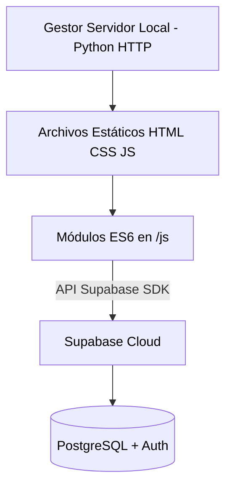

# Autodoc: Arquitectura y Estructura del Proyecto

## Tech Stack Overview

| Categoría | Tecnología | Versión / Uso |
| :--- | :--- | :--- |
| **Frontend Core** | HTML5, CSS3, Vanilla JS | ES6 Modules (`type="module"`) |
| **Diseño y UI** | Bootstrap 5, FontAwesome | Layout responsive y componentes |
| **Backend as a Service** | Supabase SDK v2 | Autenticación, Database y Storage |
| **Servidor Local** | Python (`http.server`) | Archivo `servidor.py` en puerto 8080 |

## Architecture Diagram



## Project Structure

```text
/
├── .agent/            # Orquestadores y workflows internos
├── assets/            # Imágenes, iconos y logos
├── css/               # Hojas de estilo modulares (main, components, dark-mode)
├── docs/              # Autodocumentación del orquestador
├── js/                # Lógica del cliente y clientes de Supabase
├── portales/          # Sub-Módulos de Cursos (Java, Apigee, etc.)
├── Portal Angular/    # Módulo complejo de curso Angular
├── index.html         # Archivo de entrada y estructura DOM principal
└── servidor.py        # Script Python para servir localmente
```

## Quick Start

1.  Asegurar entorno (Python 3 instalado).
2.  Ejecutar el script nativo local: `python servidor.py` (o `ejecutar_portal.bat` en Windows).
3.  Acceder a `http://localhost:8080`.
