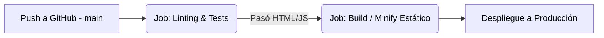

# Autodoc: Análisis de Pipeline de CI/CD

## 1. Estado Actual de Automatización

En su versión actual, el **Portal Gessof** no dispone de un pipeline tradicional configurado mediante CI/CD (GitHub Actions, Vercel, GitLab CI) de forma explícita en su árbol de directorios. 

El modelo de despliegue principal es **Manual/Local** o un despliegue transparente como aplicación estática.

## 2. Modelado del Pipeline Teórico (Recomendando)

Dada la arquitectura estática (Vanilla JS + HTML), el pipeline ideal (y hacia donde tenderá el proyecto) es un modelo SPA (Single Page Application) servido vía CDN.

## 3. Fases del Flujo de Trabajo

### Fase 1: Desarrollo
- **Entorno**: Local (Windows/Mac/Linux) ejecutando `python servidor.py`.
- **Artefacto**: Código sin compilar, modificaciones directamente iterativas.

### Fase 2: Control de Versiones
- **Entorno**: GitHub Repository (`DevGessof/Portal_Gessof`).
- **Comando**: `git push origin main`.

### Recomendación de Siguiente Paso
Añadir un flujo de GitHub Pages genérico (`.github/workflows/static.yml`) para publicar la carpeta raíz del portal y permitir testeos continuos por parte del equipo interno.
