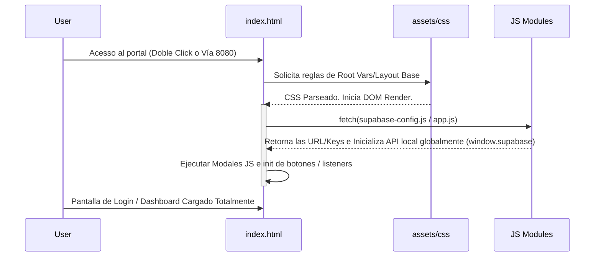

# Autodoc: Puntos de Entrada y Flujo de Arranque

## 1. Puntos de Ejecución (Bootstrapping)

El proyecto es estructuralmente un SPA sin empaquetado; el único *Entry Point* absoluto donde nace la interfaz y el árbol DOM es `index.html`.

| Componente Clave | Relevancia y Rol Técnico |
| :--- | :--- |
| **`index.html`** | Archivo raíz inicial. Define y monta la estructura semántica. Ejecuta scripts externos e incrusta JavaScript in-line para controlar el estado y lógica del DOM (Modales, Sidebar, Cambio de vistas y Contraseñas). |
| **`servidor.py`** | Script inicializador en entornos de desarrollo local. Define los encabezados `application/javascript` forzando al navegador a parsear el ecosistema ES6 Module correctamente en el puerto `8080`. |
| **`js/supabase-config.js`** | Archivo orquestador indirecto. Es invocado al inicio de la sesión para instanciar (boot) la variable y configuración SDK de red que provee acceso central a los datos. |

## 2. Secuencia de Inicialización Visual

## 3. Estado de Control Global Variables (`window.*`)

Varias estructuras están unidas al objeto general `window`, tales como variables booleanas de cierre lógico y referencias globales invocables en cualquier componente (Ej: `window.sbUpdateProfileAndAuth(null, pwd)` expuesta tras configuración).
