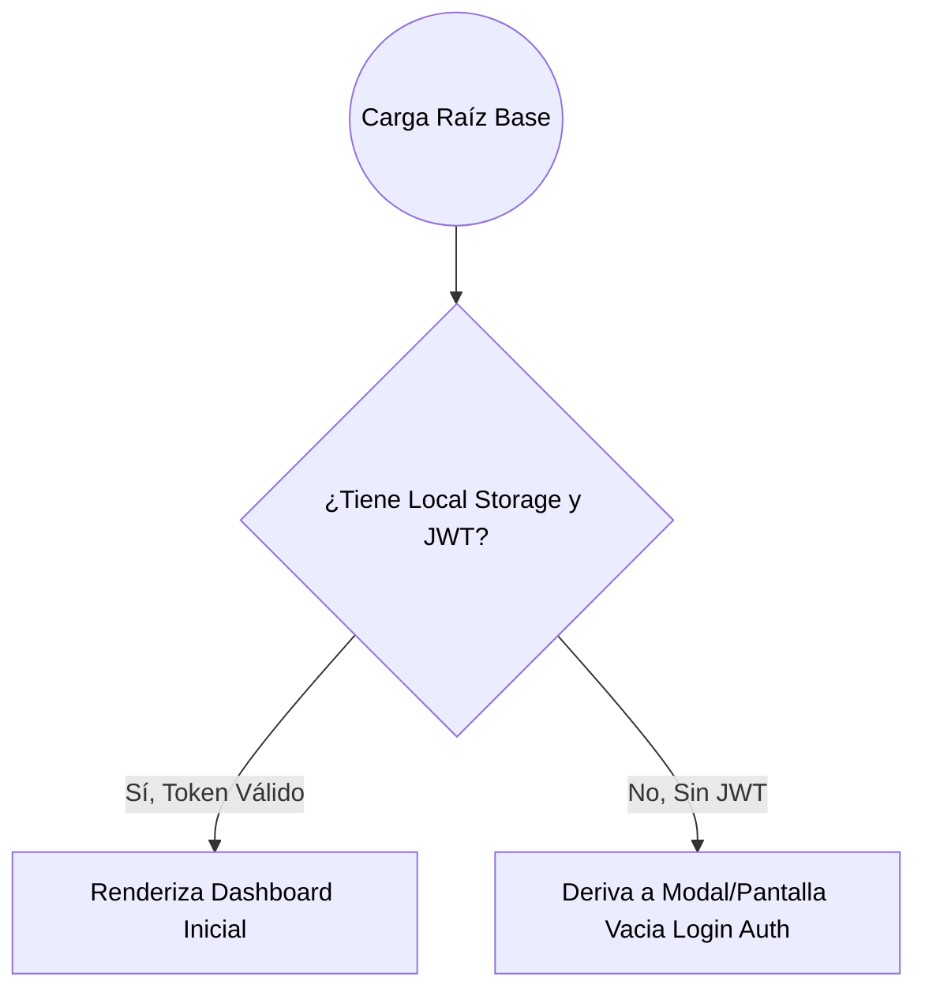

# Autodoc: Flujos de Usuario (User Journeys)

## 1. El Camino de Ingreso

## 2. Flujo Crítico de Tareas

**Caminos (Escenario Diario Ideal de Empleado PM)**

1.  **Dashboard Visual**: Entrar. Mirar tarjetas de Tareas Pendientes.
2.  **Lista Kanban**: Revisar las alertas de "Alta Prioridad".
3.  **Proceso**: Clic en finalizar tarea o Nuevo Proyecto -> Abrir `<Modal>` > Ingresar Info `Submit`
4.  **Confirmación Sensorial**: Supabase devuelve HTTP200 -> Mostrar Toast flotante Verde -> Refrescar interfaz JS de manera local (Sin reiniciar página completa/F5).

## 3. Explicación Edge Cases (Casos no deseados)

- **Contraseña Erada al Cambiar Clave**: El `User Journey` detiene al usuario forzando interactividad directa si los dos campos fallan, alertando que las claves no cuadran.
- **Conclusión Sub-portal Roto**: Un recurso de Drive Apigee Angular devuelve un link muerto por error de acceso externo. El usuario tiene un botón `<` (Back/Atrás) general fuera de su Iframe para siempre escapar del curso de capacitación de vuelta a su Root Seguro.
